# React Cheat Sheet (React + Vite + Tailwind & daisyUI)

# [Netlify Deployment](https://dynamic-pixie-fb7951.netlify.app/)

With Light/Dark Mode, Hamburger Menu & Autoscroll buttons (left & right)

I use [npm install react-masonry-css]("https://www.npmjs.com/package/react-masonry-css") to create a masonry layout

# Mobile light

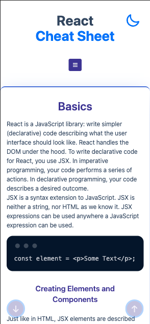
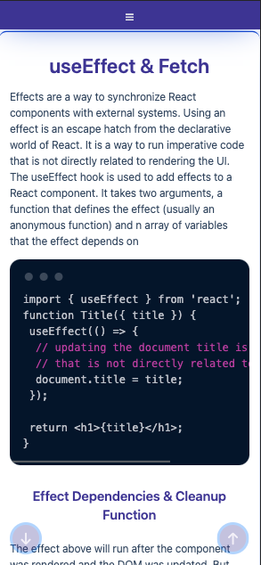
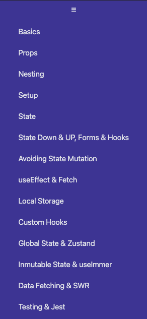

# Desktop light

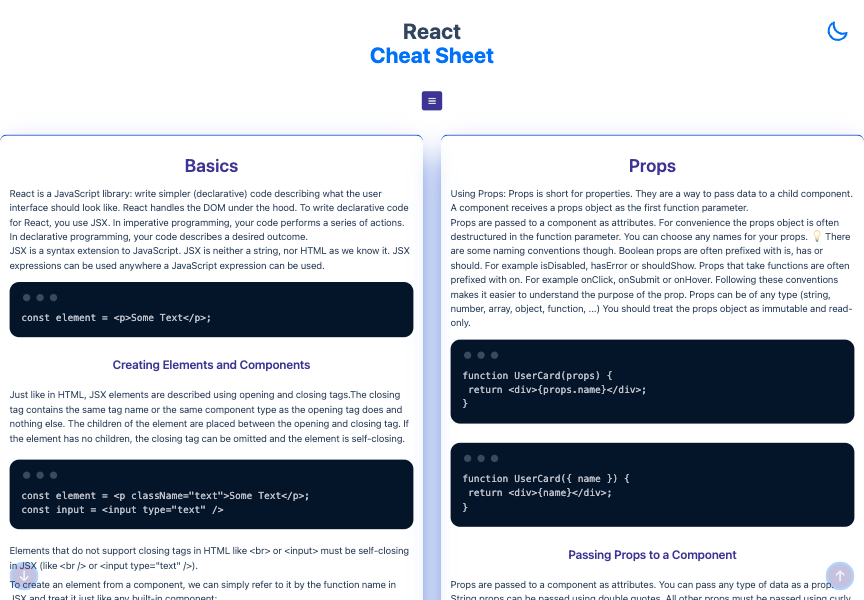
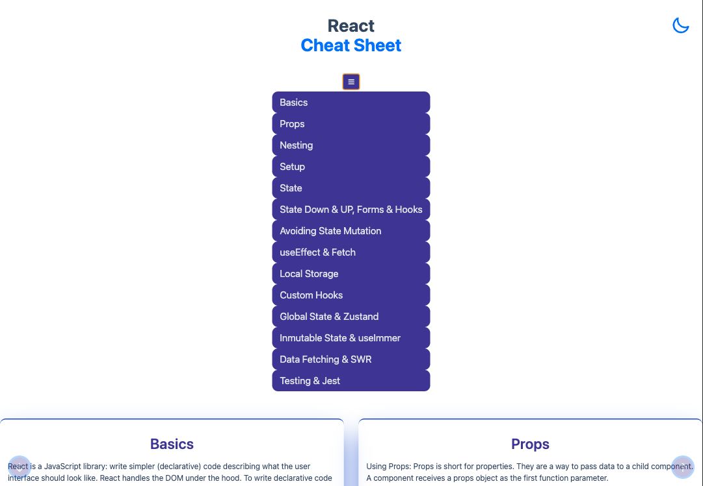
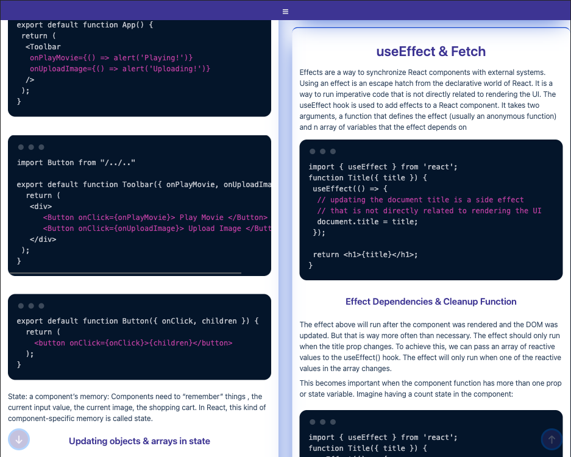

# Mobile dark

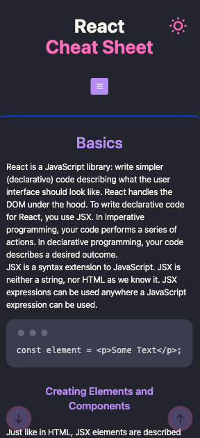
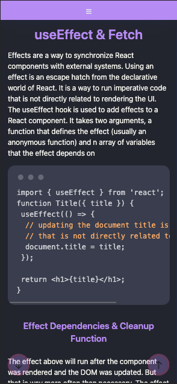
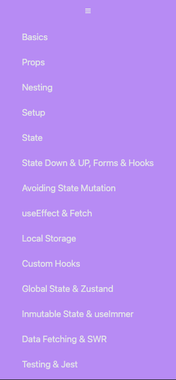

# Desktop dark

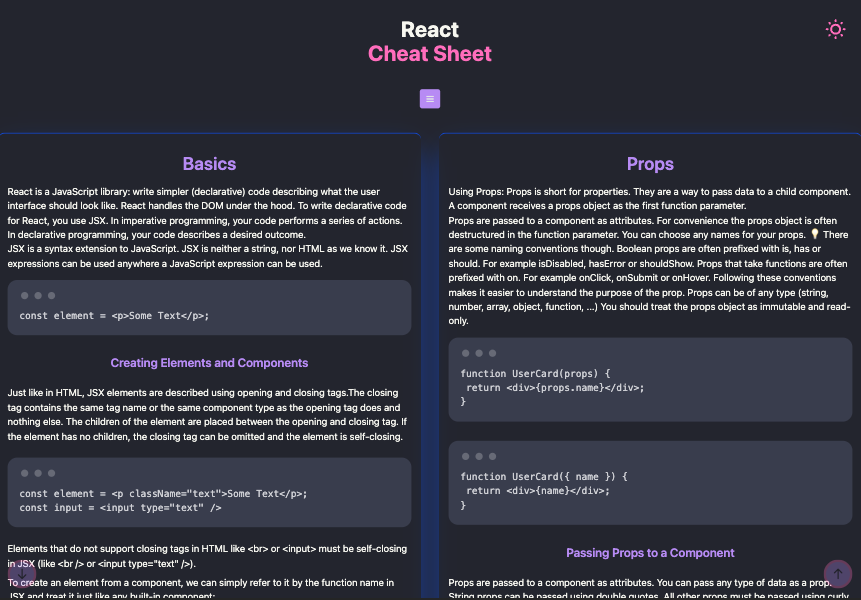
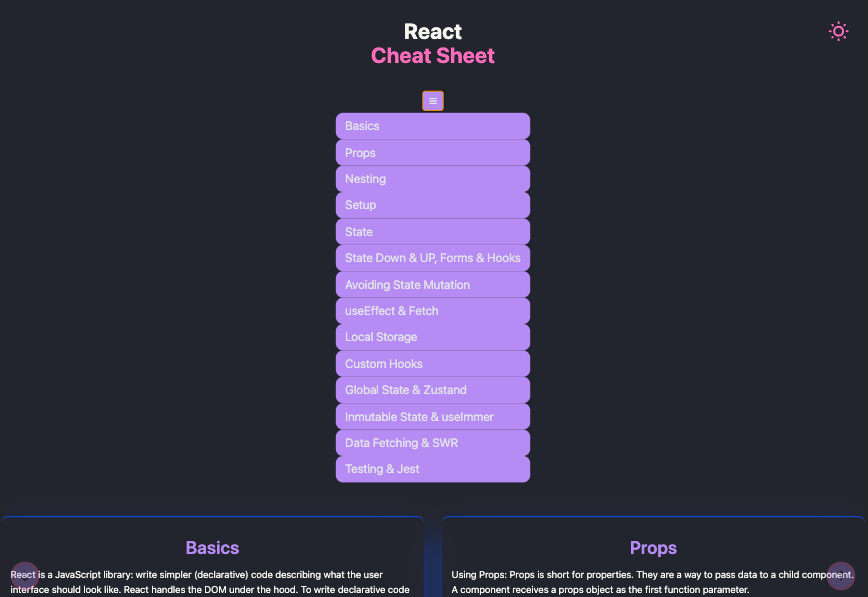
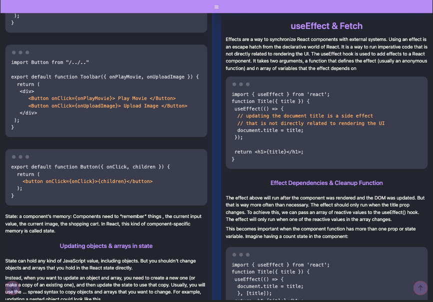

